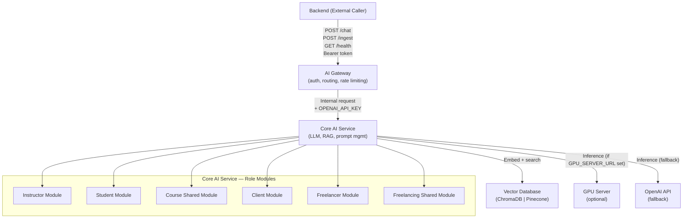

# Design Document: AI Architecture Modules

## Overview

This design extends the existing `arifgate_ai` FastAPI microservice into a multi-component AI pipeline. The current service already handles role-based chat with OpenAI and optional RAG via a single FastAPI app with bearer-token auth middleware. This extension introduces:

- An **AI Gateway** layer that sits in front of the existing service, centralizing auth, routing, and rate limiting
- A **Core AI Service** (the extended existing service) handling LLM calls, RAG, and prompt management
- A **Vector Database** abstraction supporting ChromaDB and Pinecone backends
- An optional **GPU Server** routing path for high-throughput inference
- Six **role-based modules** across two marketplace domains with structured output schemas
- **Observability** via health endpoints and structured JSON logging on both components

The two components communicate over HTTP/JSON on an internal network. The Backend (external caller) only ever talks to the AI Gateway.

---

## Architecture



### Component Responsibilities

| Component | Responsibility |
|---|---|
| AI Gateway | Auth (bearer token), role validation, rate limiting, request forwarding, structured logging |
| Core AI Service | System prompt selection, RAG retrieval, LLM call, structured output parsing, ingest, structured logging |
| Vector Database | Embedding storage and cosine-similarity search; backend-agnostic via adapter |
| GPU Server | Optional high-throughput inference endpoint; same request/response contract as OpenAI Chat Completions |
| Role Modules | Domain-specific system prompts, structured output schemas, and validation per role |

---

## Components and Interfaces

### AI Gateway

Runs as a separate FastAPI application (e.g., `gateway/main.py`). All inbound traffic from the Backend passes through here.

**Endpoints:**

| Method | Path | Description |
|---|---|---|
| `GET` | `/health` | Liveness check |
| `POST` | `/chat` | Proxy chat request to Core AI Service |
| `POST` | `/ingest` | Proxy ingest request to Core AI Service |

**Middleware stack (in order):**
1. `GatewayAuthMiddleware` — validates `Authorization: Bearer <AI_GATEWAY_SECRET>`
2. `RateLimitMiddleware` — per-client sliding-window counter, limit from `GATEWAY_RATE_LIMIT_RPM`
3. `RequestLoggingMiddleware` — emits structured JSON log after response

**Routing logic:**

```python
# Pseudocode — gateway router
async def proxy_chat(request: GatewayChatRequest) -> GatewayChatResponse:
    validate_role(request.role)          # raises 422 on unknown role
    internal_req = build_internal_request(request)
    response = await http_client.post(CORE_AI_URL + "/v1/chat", json=internal_req)
    return response.json()
```

**Environment variables consumed by Gateway:**

| Variable | Purpose |
|---|---|
| `AI_GATEWAY_SECRET` | Expected bearer token from Backend |
| `GATEWAY_RATE_LIMIT_RPM` | Max requests per minute per client |
| `CORE_AI_SERVICE_URL` | Internal URL of Core AI Service |

---

### Core AI Service

The existing `arifgate_ai` FastAPI app, extended with new routers and services. The existing `AuthMiddleware` is repurposed to validate the internal token forwarded by the Gateway.

**Endpoints:**

| Method | Path | Description |
|---|---|---|
| `GET` | `/v1/health` | Liveness check |
| `POST` | `/v1/chat` | Handle role-based chat (existing, extended) |
| `POST` | `/v1/ingest` | Ingest documents into Vector DB |

**Internal request schema (Gateway → Core AI):**

```python
class InternalChatRequest(BaseModel):
    role: Role
    module: str          # e.g. "instructor", "course_shared"
    message: str
    session_id: str | None = None
    context: dict | None = None
    use_rag: bool = False
    openai_api_key: str  # forwarded by Gateway, never returned to Backend
```

**Service call chain for `/v1/chat`:**

```
InternalChatRequest
  → ModuleRouter.resolve(role, module)   → RoleModule
  → RoleModule.build_messages(request)   → message list
  → RAGEngine.retrieve(query) [if use_rag]
  → InferenceRouter.call(messages)       → raw LLM response
  → OutputParser.parse(role, raw)        → typed output object
  → OutputSerializer.to_response(obj)    → ChatResponse
```

**Environment variables consumed by Core AI Service:**

| Variable | Purpose |
|---|---|
| `AI_SERVICE_SECRET` | Expected bearer token from Gateway |
| `OPENAI_API_KEY` | Forwarded by Gateway, used for LLM calls |
| `GPU_SERVER_URL` | Optional; if set, routes inference here |
| `VECTOR_DB_BACKEND` | `chromadb` or `pinecone` |
| `VECTOR_DB_SIMILARITY_THRESHOLD` | Minimum cosine similarity for RAG results (default `0.7`) |

---

### Vector Database Adapter

An abstract base class decouples the Core AI Service from the specific vector store backend.

```python
from abc import ABC, abstractmethod

class VectorDBAdapter(ABC):
    @abstractmethod
    async def ingest(self, documents: list[str], domain: str | None) -> int:
        """Embed and store documents. Returns count of stored docs."""

    @abstractmethod
    async def search(self, query: str, top_k: int, threshold: float) -> list[RetrievedDoc]:
        """Return top-K docs with similarity >= threshold."""
```

Concrete implementations:
- `ChromaDBAdapter` — uses `chromadb` Python client, local or remote
- `PineconeAdapter` — uses `pinecone-client`, requires `PINECONE_API_KEY` and `PINECONE_INDEX`

Factory:

```python
def get_vector_db() -> VectorDBAdapter:
    backend = os.environ.get("VECTOR_DB_BACKEND", "chromadb")
    if backend == "pinecone":
        return PineconeAdapter()
    return ChromaDBAdapter()
```

---

### Inference Router

Selects the inference backend at request time:

```python
class InferenceRouter:
    async def call(self, messages: list[dict], api_key: str) -> str:
        gpu_url = os.environ.get("GPU_SERVER_URL")
        if gpu_url:
            return await self._call_gpu(gpu_url, messages)
        return await self._call_openai(messages, api_key)

    async def _call_openai(self, messages, api_key) -> str:
        # 30s timeout; raises 502 on API error, 504 on timeout
        ...

    async def _call_gpu(self, url, messages) -> str:
        # 30s timeout; same error contract as _call_openai
        ...
```

---

### Role Modules

Each module is a Python class implementing a common interface:

```python
class RoleModule(ABC):
    system_prompt: str

    @abstractmethod
    def build_messages(self, request: InternalChatRequest, rag_docs: list[RetrievedDoc]) -> list[dict]:
        """Assemble the full message list for the LLM."""

    @abstractmethod
    def parse_output(self, raw: str) -> BaseModel:
        """Parse raw LLM text into a typed output object."""
```

Module registry (resolved by `ModuleRouter`):

| Role | Module key | Class |
|---|---|---|
| `Instructor` | `instructor` | `InstructorModule` |
| `Student` | `student` | `StudentModule` |
| `Student` / `Instructor` | `course_shared` | `CourseSharedModule` |
| `Client` | `client` | `ClientModule` |
| `Freelancer` | `freelancer` | `FreelancerModule` |
| `Client` / `Freelancer` | `freelancing_shared` | `FreelancingSharedModule` |

---

## Data Models

### Existing models (unchanged)

```python
# arifgate_ai/app/models.py
@dataclass
class Message:
    role: str       # "user" | "assistant"
    content: str

@dataclass
class Session:
    session_id: str
    role: str
    history: list[Message]
    last_active: datetime
```

### Extended schemas

```python
# New in schemas.py

class Module(str, Enum):
    instructor = "instructor"
    student = "student"
    course_shared = "course_shared"
    client = "client"
    freelancer = "freelancer"
    freelancing_shared = "freelancing_shared"

class RetrievedDoc(BaseModel):
    content: str
    similarity: float
    domain: str | None = None

class InternalChatRequest(BaseModel):
    role: Role
    module: Module
    message: str
    session_id: str | None = None
    context: dict | None = None
    use_rag: bool = False
    openai_api_key: str

# --- Structured output schemas per module ---

class CourseDescription(BaseModel):
    title: str
    summary: str
    target_audience: str
    learning_outcomes: list[str]

class JobDescription(BaseModel):
    title: str
    description: str
    required_skills: list[str]
    budget_range: str
    keywords: list[str]

class FreelancerProposal(BaseModel):
    introduction: str
    relevant_experience: str
    proposed_approach: str
    call_to_action: str

class MatchResult(BaseModel):
    profile_id: str
    similarity: float
    summary: str

class DocumentMetadata(BaseModel):
    doc_id: str
    domain: str | None
    ingested_at: datetime
    content_preview: str   # first 200 chars
```

### Gateway log entry

```python
class GatewayLogEntry(BaseModel):
    timestamp: str          # ISO-8601
    role: str
    module: str
    latency_ms: int
    status_code: int
    client_id: str | None   # derived from token hash
```

### Core AI Service log entry

```python
class CoreLogEntry(BaseModel):
    timestamp: str
    role: str
    session_id: str | None
    latency_ms: int
    status_code: int
```

---

## Correctness Properties

*A property is a characteristic or behavior that should hold true across all valid executions of a system — essentially, a formal statement about what the system should do. Properties serve as the bridge between human-readable specifications and machine-verifiable correctness guarantees.*

### Property 1: Auth validation rejects all invalid tokens

*For any* inbound request to the AI Gateway where the `Authorization` header is absent, malformed, or contains a token that does not match `AI_GATEWAY_SECRET`, the Gateway SHALL return HTTP 401 and SHALL NOT forward the request to the Core AI Service.

**Validates: Requirements 1.1, 1.2**

---

### Property 2: Role-based routing accepts valid roles and rejects unknown ones

*For any* request payload, if the `role` field is a member of the `Role` enum the Gateway SHALL route it to the correct module handler; if the `role` field is any other string the Gateway SHALL return HTTP 422.

**Validates: Requirements 1.4, 1.5**

---

### Property 3: Rate limiting enforces per-client request cap

*For any* client that sends more than `GATEWAY_RATE_LIMIT_RPM` requests within a one-minute window, all requests beyond the limit SHALL receive HTTP 429, while requests within the limit SHALL be forwarded normally.

**Validates: Requirements 1.6**

---

### Property 4: OpenAI API key is never present in Gateway responses

*For any* response returned by the AI Gateway to the Backend, the response body SHALL NOT contain the value of `OPENAI_API_KEY`.

**Validates: Requirements 1.7**

---

### Property 5: System prompt selection is correct for every (role, module) pair

*For any* valid `(role, module)` combination, the first message in the assembled LLM message list SHALL be a system message whose content matches the registered system prompt for that combination, and SHALL NOT be the system prompt of any other (role, module) pair.

**Validates: Requirements 2.2, 5.1, 6.1, 8.1, 9.1**

---

### Property 6: RAG results always meet the similarity threshold

*For any* semantic search query issued to the Vector Database, every document in the returned result set SHALL have a cosine similarity score greater than or equal to the configured threshold (default 0.7). No document below the threshold SHALL appear in results.

**Validates: Requirements 3.3, 10.2, 10.4**

---

### Property 7: Ingest round-trip integrity

*For any* document text ingested via `POST /v1/ingest`, issuing a semantic search with the original text as the query SHALL return a result whose `content` field matches the originally ingested text.

**Validates: Requirements 3.5**

---

### Property 8: Document metadata serialization round-trip

*For any* valid `DocumentMetadata` object, serializing it to JSON (via the Pretty Printer) and then deserializing the resulting JSON string SHALL produce an object that is equal to the original.

**Validates: Requirements 3.6, 11.3**

---

### Property 9: Structured output round-trip (parse → print → parse)

*For any* valid structured output object (`CourseDescription`, `JobDescription`, or `FreelancerProposal`), parsing it from a JSON string, serializing it back to JSON via the Pretty Printer, and then parsing again SHALL produce an object equal to the first parsed object.

**Validates: Requirements 11.4**

---

### Property 10: Session history preserves message order and completeness

*For any* session, after appending N messages in a given order, retrieving the session history SHALL return exactly those N messages in the same order, with no messages dropped or reordered.

**Validates: Requirements 6.4**

---

### Property 11: Shared modules accept all valid marketplace roles

*For any* request to the `CourseSharedModule` where `role` is one of `{Student, Instructor}`, and *for any* request to the `FreelancingSharedModule` where `role` is one of `{Client, Freelancer}`, the module SHALL process the request without returning a role-based rejection error.

**Validates: Requirements 7.1, 10.1**

---

### Property 12: Match results are bounded by top_k

*For any* matching request with a given `top_k` value N, the returned match list SHALL contain at most N items, and every item SHALL have a similarity score >= 0.7.

**Validates: Requirements 10.3, 10.4**

---

### Property 13: Gateway structured log entries contain all required fields

*For any* request proxied by the AI Gateway, the emitted log entry SHALL be valid JSON and SHALL contain the fields `timestamp`, `role`, `module`, `latency_ms`, and `status_code`, each with a non-null value.

**Validates: Requirements 12.3**

---

### Property 14: Core AI Service structured log entries contain all required fields

*For any* request processed by the Core AI Service, the emitted log entry SHALL be valid JSON and SHALL contain the fields `timestamp`, `role`, `session_id`, `latency_ms`, and `status_code`, each with a non-null value.

**Validates: Requirements 12.4**

---

### Property 15: CourseDescription output contains all required fields

*For any* valid Instructor request with a course topic of 5 or more characters, the parsed `CourseDescription` output SHALL contain non-empty values for `title`, `summary`, `target_audience`, and `learning_outcomes`.

**Validates: Requirements 5.2, 5.4**

---

### Property 16: JobDescription output contains all required fields

*For any* valid Client request with a project description, the parsed `JobDescription` output SHALL contain non-empty values for `title`, `description`, `required_skills`, `budget_range`, and `keywords`.

**Validates: Requirements 8.2, 8.6**

---

### Property 17: FreelancerProposal output contains all required sections

*For any* valid Freelancer request with a job description and skill summary, the parsed `FreelancerProposal` output SHALL contain non-empty values for `introduction`, `relevant_experience`, `proposed_approach`, and `call_to_action`.

**Validates: Requirements 9.2, 9.5**

---

### Property 18: Skill tag extraction is monotone with respect to skill content

*For any* freelancer profile description, adding additional skill keywords to the description SHALL NOT decrease the number of extracted skill tags returned by the Freelancer Module.

**Validates: Requirements 9.3**

---

## Error Handling

### AI Gateway

| Condition | Response |
|---|---|
| Missing or invalid `Authorization` header | HTTP 401 `{"detail": "Unauthorized"}` |
| Unknown `role` value in payload | HTTP 422 `{"detail": "Invalid field: role"}` |
| Rate limit exceeded | HTTP 429 `{"detail": "Rate limit exceeded"}` |
| Core AI Service unreachable | HTTP 502 `{"detail": "Upstream service error"}` |
| Core AI Service timeout (>30s) | HTTP 504 `{"detail": "Upstream service timeout"}` |
| Unhandled exception | HTTP 500 `{"detail": "Internal server error"}` — stack trace logged, not returned |

### Core AI Service

| Condition | Response |
|---|---|
| Missing or invalid internal bearer token | HTTP 401 `{"detail": "Unauthorized"}` |
| LLM API error | HTTP 502 `{"detail": "LLM error"}` |
| LLM or GPU Server timeout (>30s) | HTTP 504 `{"detail": "Inference timeout"}` |
| LLM output fails schema parsing | HTTP 422 `{"detail": "Output parsing error: <field>"}` |
| Course topic < 5 characters | HTTP 422 `{"detail": "course_topic must be at least 5 characters"}` |
| Unhandled exception | HTTP 500 `{"detail": "Internal server error"}` — stack trace logged, not returned |

### Vector Database

| Condition | Behavior |
|---|---|
| No documents above similarity threshold | Return empty list (not an error) |
| Backend connection failure | Raise `VectorDBConnectionError`; Core AI Service returns HTTP 502 |
| Unsupported `VECTOR_DB_BACKEND` value | Raise `ValueError` at startup; service fails to start with descriptive message |

---

## Testing Strategy

### Dual Testing Approach

Both unit tests and property-based tests are required. They are complementary:

- **Unit tests** cover specific examples, integration points, and error conditions
- **Property-based tests** verify universal properties across randomly generated inputs

### Property-Based Testing

**Library:** [`hypothesis`](https://hypothesis.readthedocs.io/) (Python)

Each property-based test MUST:
- Run a minimum of **100 iterations** (configured via `@settings(max_examples=100)`)
- Include a comment tag referencing the design property:
  `# Feature: ai-architecture-modules, Property N: <property_text>`
- Be implemented as a **single test function** per correctness property

Example structure:

```python
from hypothesis import given, settings, strategies as st

# Feature: ai-architecture-modules, Property 8: Document metadata serialization round-trip
@settings(max_examples=100)
@given(st.builds(DocumentMetadata, ...))
def test_metadata_serialization_round_trip(metadata: DocumentMetadata):
    serialized = pretty_print(metadata)
    deserialized = DocumentMetadata.model_validate_json(serialized)
    assert deserialized == metadata
```

### Unit Tests

Unit tests should focus on:
- Specific examples demonstrating correct behavior (e.g., health endpoint returns `{"status": "ok"}`)
- Integration points between components (e.g., Gateway correctly forwards internal request to Core AI)
- Error conditions (e.g., LLM returns error → 502, malformed output → 422, timeout → 504)
- Configuration-driven behavior (e.g., `VECTOR_DB_BACKEND=pinecone` returns `PineconeAdapter`)

Avoid writing unit tests that duplicate what property tests already cover (e.g., don't write 10 unit tests for different token values when Property 1 covers all of them).

### Test Coverage Map

| Property | Test Type | Hypothesis Strategy |
|---|---|---|
| P1: Auth validation | property | `st.text()` for token values |
| P2: Role routing | property | `st.sampled_from(Role)` + `st.text()` for invalid roles |
| P3: Rate limiting | property | `st.integers(min_value=1, max_value=200)` for request counts |
| P4: API key not in response | property | `st.builds(GatewayChatRequest)` |
| P5: System prompt selection | property | `st.sampled_from(list(MODULE_REGISTRY.keys()))` |
| P6: RAG threshold filter | property | `st.lists(st.builds(RetrievedDoc))` |
| P7: Ingest round-trip | property | `st.text(min_size=1)` for document content |
| P8: Metadata serialization round-trip | property | `st.builds(DocumentMetadata)` |
| P9: Structured output round-trip | property | `st.one_of(st.builds(CourseDescription), st.builds(JobDescription), st.builds(FreelancerProposal))` |
| P10: Session history order | property | `st.lists(st.builds(Message), min_size=1)` |
| P11: Shared module role access | property | `st.sampled_from([Role.student, Role.instructor])` etc. |
| P12: Match results bounded by top_k | property | `st.integers(min_value=1, max_value=20)` for top_k |
| P13: Gateway log fields | property | `st.builds(GatewayChatRequest)` |
| P14: Core AI log fields | property | `st.builds(InternalChatRequest)` |
| P15: CourseDescription fields | property | `st.text(min_size=5)` for topic |
| P16: JobDescription fields | property | `st.text(min_size=10)` for project description |
| P17: FreelancerProposal fields | property | `st.text(min_size=10)` for job description + skills |
| P18: Skill tag monotonicity | property | `st.text()` for profile description + `st.lists(st.text())` for added skills |

### Unit Test Examples

```python
# Health endpoints
def test_gateway_health():
    response = client.get("/health")
    assert response.status_code == 200
    assert response.json() == {"status": "ok"}

# Error conditions
def test_llm_error_returns_502(mock_openai_error):
    response = core_client.post("/v1/chat", json=valid_request)
    assert response.status_code == 502

def test_malformed_llm_output_returns_422(mock_openai_bad_json):
    response = core_client.post("/v1/chat", json=instructor_request)
    assert response.status_code == 422

def test_gpu_server_used_when_env_set(mock_gpu_server, monkeypatch):
    monkeypatch.setenv("GPU_SERVER_URL", "http://gpu:8080")
    response = core_client.post("/v1/chat", json=valid_request)
    assert mock_gpu_server.called

def test_vector_db_factory_returns_pinecone(monkeypatch):
    monkeypatch.setenv("VECTOR_DB_BACKEND", "pinecone")
    adapter = get_vector_db()
    assert isinstance(adapter, PineconeAdapter)
```
