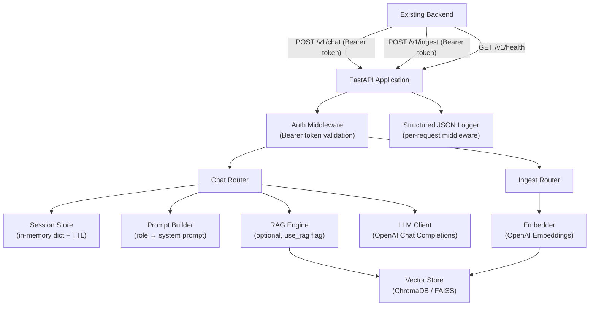

# Design Document: Role-Based AI Chatbot

## Overview

The role-based AI chatbot is a standalone Python/FastAPI microservice that provides intelligent, context-aware responses tailored to seven distinct user roles across two marketplace domains (Course Marketplace and Freelancing Marketplace). It integrates with OpenAI's Chat Completions API, manages multi-turn conversation sessions in memory, and optionally augments responses with domain-specific knowledge via a RAG pipeline backed by ChromaDB or FAISS.

The service is consumed exclusively by the existing backend over an internal network. All endpoints are versioned under `/v1` and protected by a pre-shared bearer token.

---

## Architecture



### Key Design Decisions

- **In-memory session store**: Sessions are stored in a plain Python dict with TTL tracking. This avoids an external dependency (Redis) for the initial implementation. A future migration path to Redis is straightforward by swapping the `SessionStore` interface.
- **RAG is opt-in per request**: The `use_rag` boolean in the request payload keeps the hot path fast for requests that don't need retrieval.
- **Vector store abstraction**: A `VectorStoreAdapter` interface allows switching between ChromaDB (persistent) and FAISS (in-process) without changing the RAG engine logic.
- **Role prompts as code**: System prompts are defined as a Python dict keyed by role enum, making them easy to version-control and update without a database.

---

## Components and Interfaces

### 1. FastAPI Application (`app/main.py`)

Entry point. Registers routers, middleware, and exception handlers. Mounts all routes under `/v1`.

### 2. Auth Middleware (`app/middleware/auth.py`)

Validates the `Authorization: Bearer <token>` header on every request to `/v1/chat` and `/v1/ingest`. Reads the expected token from `AI_SERVICE_SECRET` env var. Returns HTTP 401 on failure.

### 3. Chat Router (`app/routers/chat.py`)

Handles `POST /v1/chat`. Orchestrates the full request pipeline:
1. Validate role
2. Load/create session
3. Optionally invoke RAG engine
4. Build prompt (system prompt + history + new message)
5. Call LLM client
6. Persist assistant reply to session
7. Return response

### 4. Ingest Router (`app/routers/ingest.py`)

Handles `POST /v1/ingest`. Accepts a list of text documents with an optional `domain` tag, generates embeddings, and stores them in the vector store.

### 5. Health Router (`app/routers/health.py`)

Handles `GET /v1/health`. Returns `{"status": "ok"}` with HTTP 200.

### 6. Prompt Builder (`app/services/prompt_builder.py`)

Maps a `Role` enum value to its corresponding system prompt string. Raises `ValueError` for unknown roles (guarded upstream by Pydantic validation).

### 7. Session Store (`app/services/session_store.py`)

Interface:
```python
class SessionStore:
    def get(self, session_id: str) -> Session | None
    def create(self) -> Session          # generates UUID session_id
    def save(self, session: Session) -> None
    def expire_stale(self) -> None       # called on each request or via background task
```

In-memory implementation uses a `dict[str, Session]` with last-access timestamps. Sessions older than 60 minutes are evicted.

### 8. LLM Client (`app/services/llm_client.py`)

Wraps the OpenAI `AsyncOpenAI` client. Enforces a 30-second timeout. Maps OpenAI errors to HTTP 502 and timeout errors to HTTP 504.

```python
async def complete(messages: list[dict]) -> str
```

### 9. RAG Engine (`app/services/rag_engine.py`)

```python
async def retrieve(query: str, domain: str | None, top_k: int = 5) -> list[str]
```

Queries the vector store for documents with cosine similarity ≥ 0.7. Returns an empty list if no documents meet the threshold.

### 10. Vector Store Adapter (`app/services/vector_store.py`)

Abstract interface with ChromaDB and FAISS implementations:
```python
class VectorStoreAdapter:
    def add(self, texts: list[str], domain: str | None) -> None
    def query(self, query_text: str, top_k: int, threshold: float) -> list[str]
```

### 11. Logging Middleware (`app/middleware/logging.py`)

Per-request structured JSON log emitted after response:
```json
{"timestamp": "...", "role": "Student", "session_id": "...", "latency_ms": 142, "status_code": 200}
```

---

## Data Models

### Request / Response Schemas (`app/schemas.py`)

```python
from enum import Enum
from pydantic import BaseModel

class Role(str, Enum):
    student    = "Student"
    instructor = "Instructor"
    buyer      = "Buyer"
    seller     = "Seller"
    freelancer = "Freelancer"
    client     = "Client"
    admin      = "Admin"

class ChatRequest(BaseModel):
    role: Role
    message: str
    session_id: str | None = None
    context: dict | None = None
    use_rag: bool = False

class ChatResponse(BaseModel):
    reply: str
    session_id: str
    role: Role

class IngestRequest(BaseModel):
    documents: list[str]
    domain: str | None = None

class IngestResponse(BaseModel):
    ingested: int
```

### Session Model (`app/models.py`)

```python
from dataclasses import dataclass, field
from datetime import datetime

@dataclass
class Message:
    role: str   # "user" or "assistant"
    content: str

@dataclass
class Session:
    session_id: str
    role: str
    history: list[Message] = field(default_factory=list)
    last_active: datetime = field(default_factory=datetime.utcnow)
```

### Environment Variables

| Variable | Required | Default | Description |
|---|---|---|---|
| `OPENAI_API_KEY` | Yes | — | OpenAI API key |
| `OPENAI_MODEL` | No | `gpt-4o` | LLM model name |
| `AI_SERVICE_SECRET` | Yes | — | Pre-shared bearer token |
| `RAG_BACKEND` | No | `chromadb` | `chromadb` or `faiss` |
| `CHROMA_PERSIST_DIR` | No | `./chroma_db` | ChromaDB persistence path |

---

## Correctness Properties

*A property is a characteristic or behavior that should hold true across all valid executions of a system — essentially, a formal statement about what the system should do. Properties serve as the bridge between human-readable specifications and machine-verifiable correctness guarantees.*

